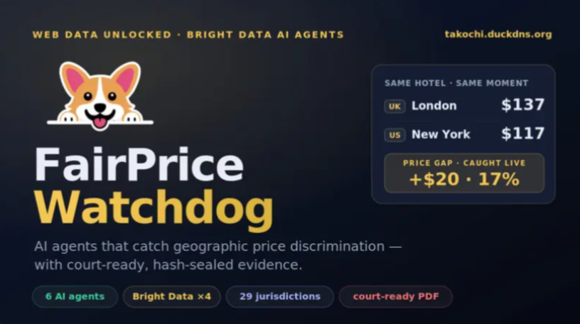

# 🚀 FairPrice Watchdog – API 

___

<h1 align="center">  
    
</h1>  

___

AI agents that catch hidden fees & geographic price discrimination — live, with court-ready, hash-sealed evidence across 29 jurisdictions.

**Web Data UNLOCKED Hackathon (Bright Data)** — submitted to **Security & Compliance** (primary) and **Finance & Market Intelligence**, with the **AI/ML API Challenge** (AIMLAPI vision + reasoning).

Built on the Bright Data web-data stack.

---

## 🌟 Project Overview

* FairPrice Watchdog is an AI-powered platform designed to detect hidden fees, junk fees, and geographic price discrimination.
* The system compares prices across locations and generates evidence-based reports.
* Built for consumers, regulators, and legal teams.
  

---

> [!IMPORTANT]
> ### 🚨 The Problem
> US consumers lose an estimated $64 billion a year to drip pricing and hidden fees. In May 2025 the FTC's Junk Fees Rule (16 CFR Part 464) made undisclosed mandatory fees illegal across all 50 states — with penalties up to $51,744 per violation. Enforcement is already landing: Greystar ($23M), Invitation Homes ($48M).
>
> But there's a bottleneck: the same listing can cost a shopper in London more than one in New York, at the same moment — and nobody can prove it at scale. Regulators and class-action firms need timestamped, tamper-proof evidence. Collecting it by hand doesn't scale.
>
> FairPrice Watchdog is the picks-and-shovels for that evidence.

___

## 🚀 What It Does

A swarm of six specialized agents takes a single URL and produces a filable complaint:

| # | Agent | Role |
|---|--------|------|
| 1 | **Crawler** | Loads the listing from a chosen location via Bright Data geo-proxies and reads the advertised price |
| 2 | **Journey Simulator** | Walks the checkout funnel and stops before payment to capture the real final total |
| 3 | **Diff** | Compares advertised vs. final price and extracts every line-item fee |
| 4 | **Law-Mapper** | Maps each fee to its exact FTC clause with a detectability tier (agent-clean / needs-review / exempt) |
| 5 | **Discovery** | Finds new operators to monitor via live web search |
| 6 | **Filing** | Assembles the SHA-256-sealed evidence bundle and generates a court-ready PDF complaint |

___

## 🔗 Original Project Repository

- This project was developed as part of a hackathon team.
- Team Leader Project Repository:
  
| Link | URL |
|------|-----|
| Repository | https://github.com/Haseeb-1698/pdc-console |

---

## 👩‍💻 My Role

- Participated as a team member.
- Contributed to presentation development and project documentation.

___

## 📄 Presentation & Documentation

Project Presentation (PPT):
Here is the Link:
[View PowerPoint Presentation](./Fair%20Price%20Watchdog.pptx)

This presentation was prepared as part of my contribution to the FairPrice Watchdog hackathon project. It includes the project overview, problem statement, solution architecture, key features, dashboards, and submission materials.

___

## 📋 Responsibilities

- Created project pitch deck and presentation slides.
- Designed slide layouts and visual structure.
- Prepared project overview and problem statement content.
- Organized submission deliverables.
- Assisted with presentation storytelling and flow.

---

## ✨ Key Features of the Project

- Hidden fee detection 💰
- Junk fee identification 🚨
- Geographic price discrimination analysis 🌎
- Evidence collection and reporting 📑
- Consumer Dashboard 👤
- Regulator Dashboard ⚖️
- Class-Action Dashboard 👥
- AI-powered analysis workflow 🤖

  ___

## ✨ What Makes It Different

- **It reads prices like a human.** When a site renders prices in JavaScript (invisible to raw scraping), the agent captures a fully-rendered screenshot via the Bright Data Browser API, and a vision model reads the price directly from the image — no brittle selectors.

- **It never hangs.** Every fetch has a hard deadline and falls back gracefully (Web Unlocker → Residential → Browser API → honest "mock" label). A blocked site degrades to a labeled result, never a frozen demo.

- **It's honest.** Every result is tagged **live / partial / mock**. We never present synthetic data as real.

- **It's court-ready.** Every HTML and screenshot capture is SHA-256 hashed and embedded in a filable FTC complaint PDF.

---

## 🛠️ Technologies Used by the Team

- Next.js
- shadcn/ui
- FastAPI
- CrewAI
- Bright Data
- PostgreSQL
- Redis

---

## 👥 Team

| Member | Role |
|---------|---------|
| **Haseeb (Takochi)** | Tech Lead & Agent Architect — pipeline, Bright Data, vision, evidence vault, deployment |
| **Eman** | Backend Engineer & DevOps — FastAPI, PostgreSQL, evidence service, PDF generator |
| **Tanzila** | Frontend Lead & Visual Design |
| **Eman Bashir** | Frontend Support & PDF Generator |
| **Matas (MrCheese)** | Domain Research — FTC taxonomy, enforcement sourcing |
| **Tom (MrSlime)** | Business Model & Market Sizing |

---

## 🎯 Repository Purpose

- Showcase my contribution to the FairPrice Watchdog hackathon project.
- Highlight presentation design and documentation work.
- Maintain records of project-related materials and deliverables.

---

## 🙏 Acknowledgment

This repository represents my individual contribution to the FairPrice Watchdog project.

The complete source code, backend services, AI agents, and technical implementation are available in the main team repository linked above.

___

**Created with 🫀 and 🧠 by Tanzila Anwar** 

___

